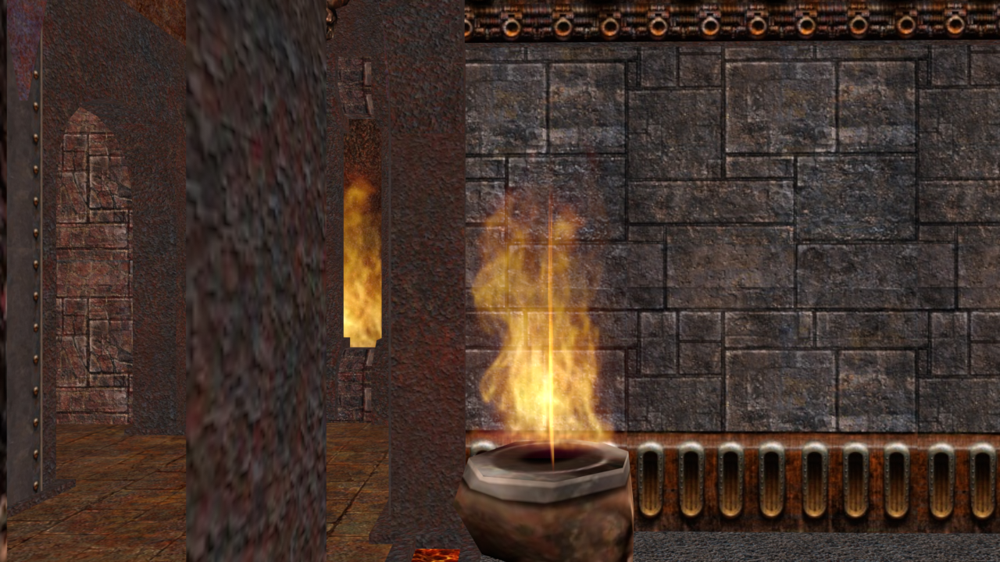
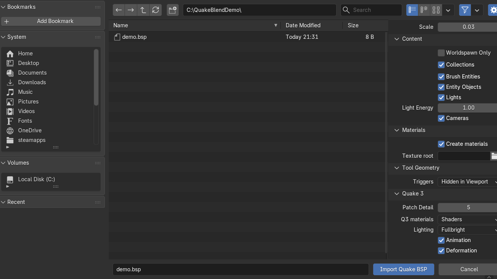

# QuakeBlend

Blender 5.0+ extension for importing **Quake 1, 2, and 3** map data and textures,
plus **GoldSrc BSP v30** levels.



_Quake III Arena BSP geometry and shader materials imported into Blender 5.0 from
user-supplied game data. Quake III Arena is an id Software title. No Quake III
game data is bundled with QuakeBlend._

Repository: <https://github.com/Tzeentchnet/QuakeBlend>

## Capabilities

* Import Quake 1, Quake 2, and Quake 3 `.map` and `.bsp` levels.
* Import GoldSrc BSP v30 geometry, embedded palettes, configured WAD3 textures,
  and entity metadata. See the [GoldSrc limitations](docs/importing.md#goldsrc-bsp).
* Optionally align connected GoldSrc maps using changelevel landmarks, with
  explicit target selection for duplicate imports.
* Convert CSG brushes, Q3 `brushDef3` geometry, and `patchDef2` surfaces into
  Blender meshes.
* Load Q1 WAD2/WAD3, Q2 WAL, and Q3 image textures with game-aware material
  handling.
* Import entities as lights, cameras, and empties while preserving their
  properties and BSP submodels.
* Export imported MAP sources with Q1, Q2, and Q3 conversion, patch handling,
  texture remapping, and optional entity edits.
* Experimentally export object transforms on unchanged source-backed Q1/Q2
  brushes with strict validation and Valve220 texture locking. See the
  [requirements and limitations](docs/exporting.md#apply-brush-transforms-experimental).
* Use a configurable world scale, with `1/32` as the default.

## Installation

Grab `quakeblend-*.zip` from the
[Releases](https://github.com/Tzeentchnet/QuakeBlend/releases) page. In
Blender 5.0+, open **Edit > Preferences > Get Extensions**, choose
**Install from Disk**, and select the zip.



*Isolated Blender 5.0 and QuakeBlend 1.3.0 capture using an original eight-byte
synthetic IBSP46 selector input.*

To build an installable archive from source:

```powershell
git clone https://github.com/Tzeentchnet/QuakeBlend.git
cd QuakeBlend
pwsh ./scripts/build_extension.ps1
```

The script writes `dist/quakeblend-<version>.zip`. See the
[installation guide](docs/installation.md) for requirements and build
options.

This source repository includes public tests, build tools, validation harnesses,
documentation, and screenshots for review and reproducibility. The installable
extension ZIP contains only the manifest, runtime package, bundled palettes, and
project license. It excludes `docs/`, `scripts/`, `tests/`, local `.private/`
material, caches, environments, and generated packaging metadata.

## Documentation

Start with the [documentation index](docs/README.md), which separates user guides,
contributor references, and bounded validation records.

* [Installation](docs/installation.md)
* [Importing](docs/importing.md)
* [Exporting](docs/exporting.md)
* [Quake 3 shader materials](docs/q3-shaders.md)
* [Testing and validation](docs/testing.md)
* [Architecture and contributing](docs/architecture.md)

## License

QuakeBlend is GPL-3.0-or-later. See [LICENSE](LICENSE).
